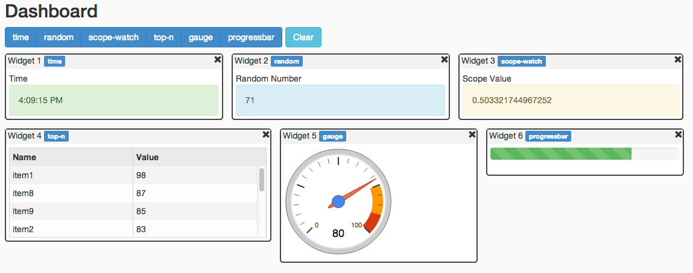

angular-dashboard
====================

[](https://travis-ci.org/DataTorrent/malhar-angular-dashboard)

Dashboard/Widgets functionality with AngularJS (directive).


Features:
---------

 - Adding/removing widgets

 - Widgets are instantiated dynamically (from corresponding directive or template)

 - Widgets drag and drop (with jQuery UI Sortable)

 - Fluid layout (widgets can have percentage-based width, or have width set in any other unit)

 - Any directive can be a widget (e.g. AngularUI directives)

 - Connecting widgets to real-time data (WebSocket, REST, etc.)

 - Changing widget data source dynamically (from widget options)

 - Saving widgets state to local storage

 - Multiple Dashboard Layouts

Contributing
------------

This project welcomes new contributors.

You acknowledge that your submissions to DataTorrent on this repository are made pursuant the terms of the Apache License, Version 2.0 (http://www.apache.org/licenses/LICENSE-2.0.html) and constitute "Contributions," as defined therein, and you represent and warrant that you have the right and authority to do so.

When **adding new javascript files**, please prepend the Apache v2.0 license header, which can be found in [CONTRIBUTING.md file](https://github.com/DataTorrent/malhar-angular-dashboard/blob/master/CONTRIBUTING.md).


Examples
--------

[Simple demo](http://datatorrent.github.io/malhar-angular-dashboard/#/) (minimum dependencies) [[source code](demo)]

[Advanced demo](http://datatorrent.github.io/malhar-dashboard-webapp/#/) (charts, visualization, data sources, etc.) [[source code](https://github.com/DataTorrent/malhar-dashboard-webapp)]



Build
-----

 Project is built with Grunt.

 ``` bash
    $ npm install -g grunt-cli
    $ grunt
 ```

Requirements
------------

- AngularJS
- Underscore.js
- jQuery
- jQuery UI
- Angular UI Sortable

Example of including dependencies from CDN [here](demo/index.html)

Getting Started
---------------

See [simple demo](demo) (two widgets) for a quick start.

Running demo with Grunt.

 ``` bash
    $ bower install
    $ grunt demo
 ```

Application will be available at http://127.0.0.1:9000

### download

With bower:

```
bower install angular-ui-dashboard
```
Manually:

Download the zip of this repo and use the files in the `dist` folder.

### include

Load `dist/angular-ui-dashboard.js` and `dist/angular-ui-dashboard.css` in your html:

```HTML
<link rel="stylesheet" href="bower_components/angular-ui-dashboard/dist/angular-ui-dashboard.css">
<script src="bower_components/angular-ui-dashboard/dist/angular-ui-dashboard.js"></script>
```

Also be sure to add it to your apps dependency list:

```JavaScript
angular.module('yourApp', [
  // other dependencies
  'ui.dashboard'
]);
```

Controller Scope vs. DataModel
-----

Widgets inherit controller scope (so normally different widgets will have bindings to different controller scope properties).

DataModel has direct access to widget scope, each widget has separate instance of DataModel.


Usage
-----

Include the dashboard directive on the element you wish to place widgets in:

```HTML
<div dashboard="dashboardOptions"></div>
```

### dashboardOptions

`dashboardOptions` in the above html is required and should be an object available on the current scope. The options on said object are as follows:


key | type | default value | required | description 
--- | ---- | ------------- | -------- | -----------
 widgetDefinitions | Array | n/a | yes | List of Widget Definition Objects. See below for available options on those. 
 defaultWidgets    | Array | n/a | yes | List of objects where an object is `{ name: [NAME_OF_WIDGET_DEFINITION] }`. TODO: Allow just list of names. 
 widgetButtons     | Boolean | true | no | Display buttons for adding and removing widgets. 
 storage   | Object | null | no | If defined, this object should implement three methods: `setItem`, `getItem`, and `removeItem`. See the **Persistence** section below.
 storageId | String | null | no (yes if `storage` is defined) | This is used as the first parameter passed to the three `storage` methods above. See the **Persistence** section below.
 storageHash | String | '' | no | This is used to validate/invalidate loaded state. See the **Persistence** section below.
 stringifyStorage | Boolean | true | no | If set to true, the dashboard state will be converted to a JSON string before being passed to `storage.setItem`. Likewise, it will be passed through JSON.parse after being retrieved from `storage.getItem`. See the **Persistence** section below.
 explicitSave | Boolean | false | no | The dashboard will not automatically save to storage for every change. Saves must instead be called explicitly using the `saveDashboard` method that is attached to the option event upon initialization.

Upon instantiation, this options object is endowed with a few API methods for use by outside code: `addWidget`, `loadWidgets`, `saveDashboard` and `loadDashboard`. 

### Widget Definition Objects

You can think of Widget Definition Objects as a __class__ and the widgets on the page as __instances__ of those classes. The options for a Widget Definition Object are:


key               | type     | default value | required | description 
----------------- | ------   | ------------- | -------- | -----------
name              | Object   | n/a           | true     | Name of Widget Definition Object. If no `templateUrl`, `template`, or `directive` are on the Widget Definition Object, this is assumed to be a directive name. In other words, the `directive` attribute is set to this value.
title             | String   | n/a           | false    | Default title of widget instances
attrs             | Object   | n/a           | false    | Map of attributes to add to the markup of the widget. Changes to these will be stored when using the `storage` option (see **Persistence** section below).
templateUrl       | String   | n/a           | false    | URL of template to use for widget content
template          | String   | n/a           | false    | String template (ignored if templateUrl is present)
directive         | String   | n/a           | false    | HTML-injectable directive name (eg. `"ng-show"`)
dataModelType     | Function | n/a           | false    | Constructor for the dataModel object, which provides data to the widget (see below for more information).
dataModelOptions  | Object   | n/a           | false    | Arbitrary values to supply to the dataModel. Available on dataModel instance as this.dataModelOptions. Serializable values in this object will also be saved if `storage` is being used (see the **Persistence** section below).
dataAttrName      | String   | n/a           | false    | Name of attribute to bind `widgetData` model
storageHash       | String   | n/a           | false    | This is analogous to the `storageHash` option on the dashboard, except at a widget-level instead of a dashboard-wide level. This can be helpful if you would only like to invalidate stored state of one widget at a time instead of all widgets.


### dataModelType

The best way to provide data to a widget is to specify a `dataModelType` in the Widget Definition Object (above). This function is used as a constructor whenever a new widget is instantiated on the page. Here is the relevant code snippet (located in the [widget directive file](https://github.com/DataTorrent/malhar-angular-dashboard/blob/master/src/directives/widget.js):

```JavaScript
// set up data source
if (widget.dataModelType) {
  var ds = new widget.dataModelType();
  widget.dataModel = ds;
  ds.setup(widget, scope);
  ds.init();
  scope.$on('$destroy', ds.destroy.bind(ds));
}
```

As shown, the `dataModelType` is a constructor function whose instances are assumed to implement the following methods: `setup`, `init`, and `destroy`.

#### `setup`
This function is called once when a widget is instantiated. It takes two arguments: (1) the instance of the [`WidgetModel`](https://github.com/DataTorrent/malhar-angular-dashboard/blob/master/src/models/widgetModel.js) constructor that corresponds to the widget instance, and (2) the scope of the widget.

#### `init`
This function is called once when a widget is instantiated. This function does not take any arguments.

#### `destroy`
This function is called when the widget is removed from the dashboard. It does not take any arguments. It should be used to clean up any listeners that may otherwise hang around, e.g. unsubscribing to a WebSocket topic or RESTful endpoint.

It is recommended to prototypically extend from the [`WidgetDataModel`](https://github.com/DataTorrent/malhar-angular-dashboard/blob/master/src/models/widgetDataModel.js) constructor, which implements the `setup` function. [Take a look at the code here](https://github.com/DataTorrent/malhar-angular-dashboard/blob/master/src/models/widgetDataModel.js).

Here is an example way to extend from `WidgetDataModel`:

```JavaScript
angular.module('myApp')
  // Inject other services like $http here, if necessary:
  .factory('MyDataModel', ['WidgetDataModel', function (WidgetDataModel) {
      function MyDataModel() {}
      MyDataModel.prototype = Object.create(WidgetDataModel.prototype);
      MyDataModel.prototype.init = function() {
        // My custom data model setup, like subscribing
        // to WebSocket or starting a REST call interval
      }
      MyDataModel.prototype.destroy = function() {
        // My custom data model teardown, like unsubscribing
        // to WebSocket or clearing a setInterval
      }
      return MyDataModel;
    }]);
```

Persistence
-----------
This dashboard component offers a means to save the state of the user's dashboard. Specifically, the dashboard can automatically save:

- instantiated widgets
- width of widgets
- order that widgets are displayed
- widget titles
- any serializable data stored in `dataModelOptions` if the widget instance has a `ds` (instantiated `dataModelType`)

There are three options you can specify in the `dashboardOptions` object relating to persistence:

### `storage` (Object)
This object will be used by the dashboard to save its state. It should implement the following three methods:

- **storage.getItem(String `key`)**
  This method will be used to attempt to retrieve previous dashboard state. It can return either a string or a promise. "promise" in this context simply means an object that has a `then` function that takes a `successCallback` and `errorCallback` as its first and second arguments. This follows the most common promise interface (it works with angular's `$q` promise, jQuery's `$.Deferred()` promise, and many others).
- **storage.setItem(String `key`, String `value`)**
  This method is assumed to store `value` in a way that will be accessible later via the `getItem` method above.
- **storage.removeItem(String `key`)**
  This method is assumed to remove items set with the `setItem` method above.

### `storageId` (String)
This string will be used as the `key` argument in the three methods on the `storage` object, outlined above. This allows for multiple dashboard instances to exist with storage on a single page and site. **This is required in order for storage to work.**

### `storageHash` (String)
This string will be stored along with the dashboard state. Then later, when state is loaded, the loaded value will be compared to the value passed to `dashboardOptions`. If the values are different, the item in storage will be assumed to be invalid and `removeItem` will be called to clear it out. This is so that if you as the developer makes changes that are not backwards compatible with previous dashboard configurations, you can simply change the `storageHash` and not have to worry about strange behavior due to stale dashboard state. **This is optional but is highly recommended.**

### `stringifyStorage` (Boolean)
By default (`stringifyStorage=true`), the dashboard will convert its state (a JavaScript Object) to a string using `JSON.stringify` before passing it to `storage.setItem`. Additionally, the dashboard will assume that `storage.getItem` will return a JSON string and try to parse it with `JSON.parse`. This works with `window.localStorage` nicely, since objects cannot be used as `value` in `localStorage.setItem(key, value)`. However, if you are implementing your own `storage` and would not like this stringification business, set `stringifyStorage` to `false`.


Dashboard Layouts
-----------------
One common requirement for user-customizable dashboards is the ability to have multiple layouts consisting of the same set of widget definitions. This sounds more confusing than it is, so the best way to understand it is to take a look at the [layouts demo](http://datatorrent.github.io/malhar-angular-dashboard/#/layouts). You can also see this demo by running `grunt demo` and navigating to `/#/layouts`. This is achieved by using the `dashboard-layouts` directive:

```HTML
<div dashboard-layouts="layoutOptions"></div>
```

### layoutOptions
The `layoutOptions` object passed to dashboard-layouts tries to mirror `dashboardOptions` as closely as possible:

key | type | default value | required | description 
--- | ---- | ------------- | -------- | -----------
 widgetDefinitions | Array | n/a | yes | Same as in `dashboardOptions` 
 defaultLayouts    | Array | n/a | yes | List of objects where an object is `{ title: [STRING_LAYOUT_TITLE], active: [BOOLEAN_ACTIVE_STATE], defaultWidgets: [ARRAY_DEFAULT_WIDGETS] }`. Note that `defaultWidgets` is the same as in `dashboardOptions`.
 widgetButtons     | Boolean | true | no | Same as in `dashboardOptions`
 storage   | Object | null | no | Same as in `dashboardOptions`, only the saved objects look like: `{ layouts: [...], states: {...}, storageHash: '' }`
 storageId | String | null | no (yes if `storage` is defined) | This is used as the first parameter passed to the three `storage` methods `setItem`, `getItem`, `removeItem`. See the **Persistence** section above.
 storageHash | String | '' | no | Same as in `dashboardOptions`
 stringifyStorage | Boolean | true | no | Same as in `dashboardOptions`
 explicitSave | Boolean | false | no | Same as in `dashboardOptions`

As with `dashboardOptions`, `layoutOptions` gets endowed with the methods `addWidget`, `loadWidgets`, `saveDashboard` and `loadDashboard`. These will be applied to the currently active dashboard layout. Additionally, a method called `saveLayouts` is attached to the `layoutOptions` object. This method will save the state of the layouts explicitly.

Links
-----

[malhar-angular-widgets](https://github.com/DataTorrent/malhar-angular-widgets) Widget library (widgets, data models, WebSocket, etc.)

[malhar-dashboard-webapp](https://github.com/DataTorrent/malhar-dashboard-webapp) Demo using this dashboard and widget library

[Node.js](http://nodejs.org/) Software platform built on JavaScript runtime

[AngularJS](http://angularjs.org/) JavaScript framework

[ui-sortable](https://github.com/angular-ui/ui-sortable) AngularJS UI Sortable

[jQuery UI Sortable](http://jqueryui.com/sortable/) jQuery UI Sortable plugin (reordering with drag and drop)

[Bower](http://bower.io/) Package manager for the web

[Grunt](http://gruntjs.com/) JavaScript Task Runner
